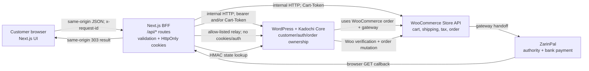
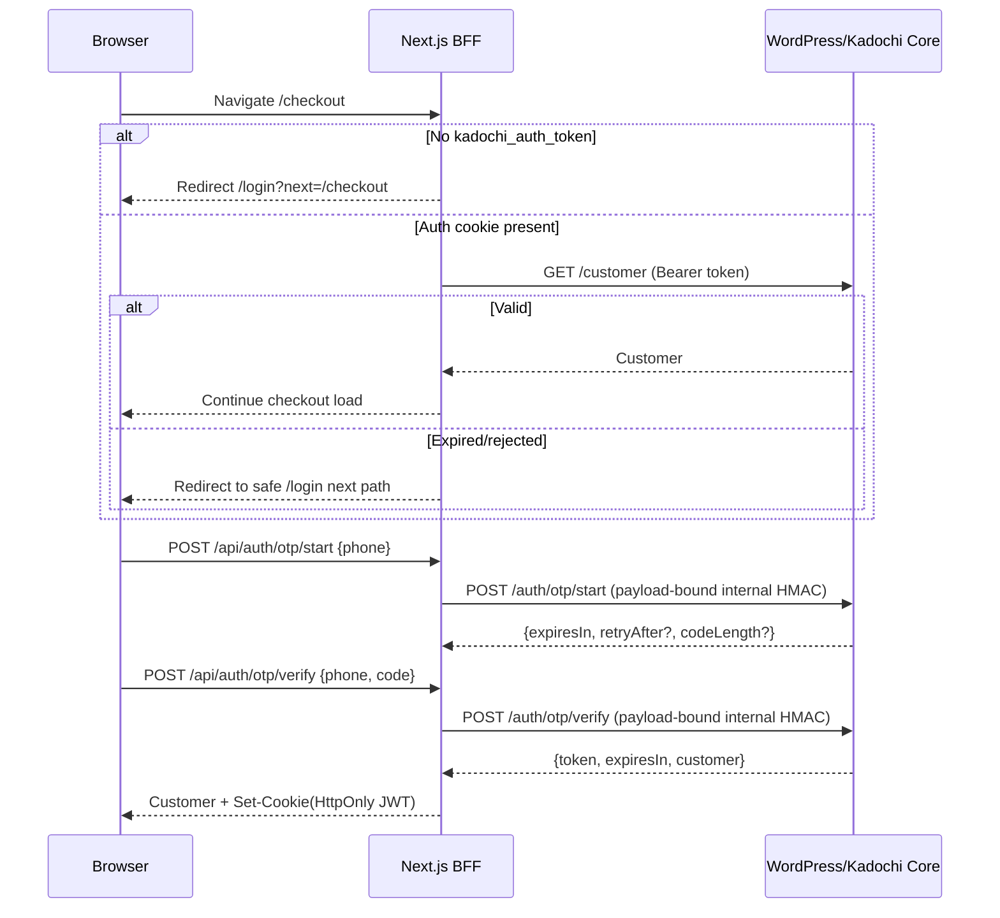

# Order flow: cart → authentication → checkout → submit → payment → done

This is the implemented Kadochi purchase flow. It describes the current application behavior, not a proposed flow. The only checkout payment choice currently exposed is the configured WooCommerce gateway, `KADOCHI_PAYMENT_METHOD_ID` (normally `WC_ZPal` / ZarinPal).

## System boundary



The browser never receives the opaque JWT or Woo cart token. The BFF owns them as `HttpOnly`, `SameSite=Lax`, path-wide cookies, secure in production:

| Cookie | Purpose | Lifetime / rotation |
| --- | --- | --- |
| `kadochi_cart_token` | Identifies the guest/session cart to Woo Store API | Rotated when returned through normal cart/checkout BFF responses; max age seven days |
| `kadochi_auth_token` | Opaque WordPress JWT for the authenticated Woo customer | Seven-day JWT; cleared when absent, expired, or rejected |

All BFF calls use `Cache-Control: no-store`, validate request and response shapes, assign/forward an `x-request-id`, and reject cross-site state-changing requests before contacting WordPress. Browser code does not calculate stock limits, prices, discounts, shipping, tax, or totals.

## End-to-end state chart

```mermaid
flowchart TD
  start(["Browse / add item"])
  cartLoad["Load Woo cart\nGET /api/cart"]
  cartState{"Cart loaded?"}
  cartError["CART_UNAVAILABLE\nShow retryable cart error"]
  cartEmpty["CART_EMPTY\nShow products link"]
  cartReady["CART_READY\nItems + authoritative totals"]
  cartMutate["Cart mutation\nadd / change quantity / remove\noptional cross-sell"]
  start --> cartLoad --> cartState
  cartState -- "No" --> cartError
  cartError -- "Reload" --> cartLoad
  cartState -- "Yes; no items" --> cartEmpty
  cartState -- "Yes; items" --> cartReady
  cartReady --> cartMutate --> cartReady
  cartReady --> checkoutEntry["Continue to /checkout"]

  checkoutEntry --> session{"Auth cookie present?"}
  session -- "No" --> login["LOGIN\n/login?next=/checkout"]
  session -- "Yes" --> checkoutLoad["GET /api/checkout\nConfirm customer + cart"]
  login --> otpStart["POST /api/auth/otp/start"]
  otpStart --> otpChoice{"Challenge started?"}
  otpChoice -- "No: invalid / cooldown / rate limit / provider error" --> login
  otpChoice -- "Yes" --> otp["OTP_ENTRY\n4–6 digits; expires in 180 s"]
  otp --> otpVerify["POST /api/auth/otp/verify"]
  otpVerify --> verifyChoice{"Verified?"}
  verifyChoice -- "No: wrong, expired, limited, unavailable" --> otp
  verifyChoice -- "Yes" --> sessionStored["AUTHENTICATED\nBFF sets HttpOnly JWT cookie"]
  sessionStored --> checkoutLoad

  checkoutLoad --> checkoutChoice{"Checkout state valid?"}
  checkoutChoice -- "Unauthenticated" --> login
  checkoutChoice -- "Empty cart" --> cartEmpty
  checkoutChoice -- "Gateway unavailable / service failure" --> checkoutUnavailable["CHECKOUT_UNAVAILABLE\nStay out of payment"]
  checkoutChoice -- "Yes" --> details["CHECKOUT_DETAILS\nSender, recipient, saved address"]
  details --> delivery["CHECKOUT_DELIVERY\nAddress totals refreshed; delivery + packaging"]
  delivery --> review["CHECKOUT_PAYMENT_REVIEW\nCoupon, shipping, totals, ZarinPal"]
  review --> submit["SUBMITTING\nOne operation UUID; UI submission lock"]

  submit --> submitChoice{"BFF / Woo result"}
  submitChoice -- "payment.state = paid" --> success["DONE_SUCCESS\n/checkout/success?order=id"]
  submitChoice -- "Trusted ZarinPal URL" --> gateway["PAYMENT_GATEWAY\nExternal ZarinPal page"]
  submitChoice -- "Order but no URL" --> returnPage["PAYMENT_RETURN_CHECK\n/checkout/return?order=id"]
  submitChoice -- "payment.state = failed/cancelled" --> failure["DONE_FAILURE\n/checkout/failure?order=id"]
  submitChoice -- "Validation/configuration before order" --> review
  submitChoice -- "Ambiguous retryable failure" --> reconcile["RECONCILING\nLookup order by operation UUID"]
  reconcile -- "Authoritative paid" --> success
  reconcile -- "Any non-terminal or unreachable state" --> unknown["PAYMENT_UNKNOWN\nNo automatic payment attempt"]

  gateway --> gatewayOutcome{"Gateway callback/result"}
  gatewayOutcome -- "Next callback relay + state" --> returnPage
  returnPage --> returned{"Owner-only payment.state"}
  returned -- "paid" --> success
  returned -- "failed/cancelled" --> failure
  returned -- "pending/unknown" --> unknown
  failure --> retry{"Customer retries payment?"}
  retry -- "No" --> doneUnpaid(["Unpaid order remains visible"])
  retry -- "Yes: new attempt UUID" --> gateway
  success --> donePaid(["Paid order complete"])
```



## State ownership and transitions

| State | Owner | Entered when | Permitted next states |
| --- | --- | --- | --- |
| `CART_UNAVAILABLE` | Browser/BFF | Cart fetch fails | Reload cart |
| `CART_EMPTY` | Woo cart snapshot | Cart has no items | Browse/add products |
| `CART_READY` | Woo cart snapshot | Cart contains at least one item | Mutate cart, continue to checkout |
| `LOGIN` | Browser auth UI | Checkout has no auth cookie, or protected request is unauthenticated | Start OTP |
| `OTP_ENTRY` | WordPress OTP challenge + browser form | OTP start succeeds | Verify, resend, edit phone |
| `AUTHENTICATED` | BFF/WordPress | OTP is verified and cookie set | Load checkout |
| `CHECKOUT_DETAILS` | Browser draft | Authenticated checkout state is valid | Save/select address, calculate cart destination, next step |
| `CHECKOUT_DELIVERY` | Browser draft + Woo cart | Details and a saved address are valid | Select rate/slot/package/postcard, previous/next |
| `CHECKOUT_PAYMENT_REVIEW` | Browser draft + authoritative cart | Delivery choices complete | Apply/remove one coupon, submit, previous |
| `SUBMITTING` | Browser submission lock + BFF | Customer presses Pay | Gateway handoff, normalized result, recoverable error |
| `PAYMENT_GATEWAY` | ZarinPal/Woo | A trusted ZarinPal redirect has been returned | Gateway callback/return/cancel |
| `PAYMENT_RETURN_CHECK` | Next.js server | There is an order but no direct final result, or gateway has returned | Success/failure/neutral screen after owner-only `payment.state` lookup |
| `PAYMENT_UNKNOWN` | Browser | A retryable post-submit failure cannot be reconciled | No automatic or repeated payment; customer follows return link/support guidance |
| `DONE_SUCCESS` | Woo order | Owner-only summary reports `payment.state: paid` | View orders; cart clear attempted |
| `DONE_FAILURE` | Woo order | Summary reports `failed` or `cancelled` | Start a fresh payment attempt |

## 1. Cart

### Cart lifecycle

1. `/basket` calls the BFF, which reads `kadochi_cart_token` if present and calls `GET /wp-json/wc/store/v1/cart`.
2. Woo returns a cart snapshot and may return a replacement `Cart-Token`; the BFF saves that token only in the cookie and returns a mapped cart DTO to the browser.
3. The browser shows one of:
   - **Unavailable:** fetch failed; show an error and allow reload.
   - **Empty:** show an empty-cart message and link to `/products`.
   - **Ready:** show normal cart lines, non-essential cross-sell rail, server totals, and the checkout link.
4. A cart mutation is never retried automatically. Its authoritative response replaces the browser cart snapshot and rotates the token if Woo sends one.

### Cart options

| Customer option | BFF route | Woo Store API action | Result / guard |
| --- | --- | --- | --- |
| Read cart | `GET /api/cart` | `GET /cart` | New/rotated cart token is cookie-only |
| Add product/variation | `POST /api/cart/items` | `POST /cart/add-item` | Woo validates product, variation, stock, and quantity |
| Change line quantity | `PATCH /api/cart/items/{itemKey}` | `POST /cart/update-item` | Uses Woo-provided minimum, maximum, multiple-of, and editable limits |
| Remove line | `DELETE /api/cart/items/{itemKey}` | `POST /cart/remove-item` | Updates server totals |
| Add/remove cross-sell | `POST /api/cart/cross-sells/items`; normal remove route | Store API add/remove | Cross-sell lines count in totals/checkout but render in the rail only |
| Update cart customer/destination | `PATCH /api/cart/customer` | `POST /cart/update-customer` | Refreshes authoritative shipping/tax totals |
| Select shipping rate | `POST /api/cart/shipping-rate` | `POST /cart/select-shipping-rate` | May be selected only from Woo-returned package/rate IDs |
| Apply coupon | `POST /api/cart/coupons` | `POST /cart/apply-coupon` | Checkout UI permits at most one coupon at a time |
| Remove coupon | `DELETE /api/cart/coupons/{code}` | `POST /cart/remove-coupon` | Removes the server-held coupon and refreshes totals |

The current checkout is Tehran-only. Kadochi Core removes shipping rates and tax applicability outside `IR` / Tehran; Woo remains the source of shipping rates, tax, discounts, inventory, and monetary totals.

## 2. Authentication gate

Checkout itself is authenticated, but a cart can be built as a guest.



### Authentication outcomes

| Branch | Behavior |
| --- | --- |
| Valid existing cookie | Checkout loads customer state. `AuthProvider` confirms it through `GET /api/auth/current`; cookie presence alone is not treated as confirmed authentication. |
| Missing cookie | Server redirects to `/login?next=/checkout`. |
| Invalid, expired, or rejected cookie | Protected operation reports `unauthenticated`; checkout redirects to login. `GET /api/auth/current` clears the stale cookie and returns `null`. |
| Phone input invalid | Browser blocks OTP start; Iranian formats are normalized (`09…`, `0098…`, `+98…`, Persian/Arabic digits) to `+989…`. |
| OTP start succeeds | WordPress creates an 180-second challenge; browser moves to code entry. |
| OTP resend | Available after WordPress's retry delay; UI permits up to three resends in the form. WordPress enforces a 60-second cooldown, per-phone hourly cap, global hourly circuit breaker, and per-phone lock. |
| Wrong/expired OTP | Browser remains on OTP entry. WordPress allows at most five verification attempts and consumes a successful challenge. |
| SMS/provider/rate-limit error | Safe error DTO exposes retryability/retry delay where available; browser stays in the appropriate auth step. |
| OTP verified | WordPress resolves or creates the Woo customer, issues a seven-day JWT, and the BFF stores it without exposing it to JavaScript. |
| Already authenticated user visits login | `LoginFlow` sends them to the validated local `next` path. External, protocol-relative, and backslash-containing next paths are rejected in favor of `/`. |

In local/development WordPress accepts only the documented sample phone/code and does not send an SMS. In production, OTP start/verify calls require the BFF's short-lived payload-bound HMAC; direct public calls are rejected.

## 3. Checkout initialization and choices

### Initialization

`GET /api/checkout` requires a valid authenticated customer, then does the following in the BFF:

1. Reads the current Woo cart with both bearer identity and current cart token.
2. Rejects an empty cart with `409 conflict`; the page redirects to `/basket`.
3. Fetches the authenticated customer's saved addresses and published postcard designs.
4. Derives delivery slots from the current cart's preparation time.
5. Requires that the configured payment ID is listed in Woo's `cart.payment_methods`; otherwise it fails closed with a configuration error.
6. Returns `CheckoutState = { cart, customer, deliverySlots, packagingOptions, postcardDesigns, paymentMethod, savedAddresses }` and persists any rotated cart token.

The page either renders the three-step flow, redirects to login/basket for the conditions above, or shows **checkout unavailable** for other failures. There is no cash-on-delivery or alternate gateway selection in the current implementation.

### Customer-visible checkout options

| Step | Choice | Values / validation | Backend effect |
| --- | --- | --- | --- |
| Details | Sender name | Required first and last name, up to 100 chars each | If the customer account name is initially incomplete, it is saved to `/api/profile`; authenticated phone/email cannot be edited here |
| Details | Recipient | **Self** uses sender name and account phone; **Other** requires first name, last name, and normalized Iranian phone | BFF derives final shipping address identity |
| Details | Address | Select saved address; create, edit, or delete an owner-only saved address (up to 20) | Chosen address is copied to Woo cart customer data; city/country are fixed to `تهران` / `IR` |
| Details | Map point | Optional latitude/longitude on the saved address | Sent as an additional checkout field, format/range validated server-side |
| Delivery | Shipping rate | Select among Woo-returned package/rate IDs | Calls cart shipping-rate route and reloads authoritative totals |
| Delivery | Delivery slot | One available slot | Three Tehran calendar days × 10–13, 13–16, 16–19; Friday, past, and insufficient-preparation slots remain visible but cannot be selected |
| Delivery | Packaging | `gift` (default) or `normal` | Stored as validated Woo additional checkout field; both currently have zero fee |
| Delivery | Postcard | Off, or on with one published design and optional message ≤200 chars | A design is required when enabled; WordPress validates it and snapshots its title onto the order |
| Payment review | Coupon | Apply one code, remove it, or leave none | Cart BFF mutates Woo cart and returns new totals; client never recalculates them |
| Payment review | Payment method | Configured single method, normally ZarinPal | Must still be available on the current Woo cart at submit time |

The **Details → Delivery** transition also writes billing and shipping data into the Woo cart through `POST /cart/update-customer`, so Woo recalculates shipping and tax before the payment review. Failure leaves the customer in Details with an error instead of using stale totals.

## 4. Submit: create the Woo order safely

The client generates one UUID `operationId` for the checkout submission and locks the Pay button. The operation ID serves both as the `Idempotency-Key` header and as a persisted Woo additional field.

```mermaid
sequenceDiagram
  participant UI as Checkout UI
  participant BFF as POST /api/checkout
  participant WP as WordPress + Woo Store API
  participant Core as Kadochi Core

  UI->>BFF: Submit selected fields + operationId UUID
  BFF->>BFF: Validate schema; derive phone/email/city/country
  BFF->>WP: GET /wc/store/v1/cart (auth + cart token)
  BFF->>BFF: Reject empty cart, unavailable slot, unavailable method
  BFF->>WP: PUT /wc/store/v1/checkout?__experimental_calc_totals=true
  Note over BFF,WP: Persist payment method + additional fields in Woo draft
  WP-->>BFF: Draft; possibly new Cart-Token
  BFF->>WP: POST /wc/store/v1/checkout + Idempotency-Key
  Note over BFF,WP: Billing/shipping + payment method + repeated fields
  WP->>Core: Validate/order-persist/operation lock
  WP-->>BFF: Checkout result or structured 400
  BFF-->>UI: Safe result, redirect, or reconciliation outcome
```

### Client payload and server-owned fields

The browser may submit only the sender/recipient names, selected saved-address details and optional map point, delivery slot, packaging, postcard settings, and `operationId`. It cannot submit totals, taxes, shipping costs, payment method, sender phone/email, country, or city.

The BFF derives and sends:

- billing phone/email from the authenticated customer;
- shipping recipient from **self** or **other** selection;
- `country: IR` and `city: تهران` for both addresses;
- the configured payment method ID;
- additional fields: delivery slot, packaging, postcard text/design, map location, and operation UUID.

The BFF first sends `PUT /wc/store/v1/checkout?__experimental_calc_totals=true` to persist the draft and then `POST /wc/store/v1/checkout` to materialize the order. Additional fields are repeated on POST for WooCommerce 10.8+ compatibility. Cart-token rotation is carried forward between every Store API call.

### Submit rejection paths

| Condition | Outcome |
| --- | --- |
| Invalid client shape, names, phone, address, postcard combination, UUID, or field bounds | `400 validation` with safe field errors; local validation keeps the customer in or returns them to the incomplete step |
| Auth expired | `401 unauthenticated`; server page/route moves customer to login |
| Cart empty | `409 conflict`; checkout page redirects to basket |
| Configured method no longer in `cart.payment_methods` | `503 configuration`; checkout is unavailable rather than selecting another method |
| Delivery slot changed since page load | `400 validation`; customer must choose a currently available slot |
| WordPress rejects packaging, postcard design/message, location, or missing operation field | Order is not accepted; error is surfaced safely |
| Duplicate operation submitted concurrently | Kadochi Core's atomic operation lock rejects the second checkout from proceeding to payment |
| Non-gateway Woo `400` | Fails closed as checkout validation failure |

Kadochi Core validates the final materialized order again, records `_kadochi_checkout_operation`, and atomically locks `kadochi_checkout_operation_{sha256(operationId)}` immediately before payment. Draft / checkout-draft orders expire after one hour (both on relevant requests and through a five-minute cron task).

## 5. Provider-neutral payment start, callback, and result

### Shared payment contract

Checkout and owner-scoped order summaries use one payment decision field:

```ts
payment: { provider, state, redirectUrl? }
// state: "paid" | "failed" | "cancelled" | "pending" | "unknown"
```

`paid` and Woo `status` remain only compatibility fields on order summaries. Frontend payment routing does not branch on either one. A `redirectUrl` is usable only with `pending` and only after the registered provider adapter validates its exact HTTPS host.

| State | Browser destination | Retry |
| --- | --- | --- |
| `paid` | `/checkout/success?order={id}` | Never |
| `failed` / `cancelled` | `/checkout/failure?order={id}` | Explicit retry only |
| `pending` / `unknown` | `/checkout/return?order={id}` | Never automatically |

After a post-submit transport error, the BFF reads the owner-scoped operation summary but does not create or recover a payment attempt. A terminal state routes to its result page; `pending` and `unknown` remain neutral.

### Payment-start endpoint and attempt states

For the initial registered-provider handoff and a retry from the failure screen, the BFF calls:

`POST /api/profile/orders/{orderId}/retry-payment` → `POST /wp-json/kadochi/v1/profile/orders/{orderId}/retry-payment`

The request contains a payment `attemptId` UUID. The initial checkout uses its operation UUID as that attempt ID; a manual retry creates a new UUID.

| Payment-attempt branch | WordPress/Kadochi Core behavior | Browser-visible result |
| --- | --- | --- |
| Owner's unpaid payable order (`draft`, `checkout-draft`, `pending`, `pending-payment`, or `failed`) + new attempt | Atomically creates a per-order payment-attempt lock, records `pending`, invokes configured gateway | Trusted provider redirect |
| Same/previous attempt already captured a trusted redirect | Returns the saved redirect rather than requesting a second authority | Navigate/re-navigate to the same gateway handoff |
| Attempt is running and lock is <60 seconds old | Returns `409 payment_in_progress` with retry delay | Do not start a duplicate payment; retry/recovery waits |
| Stale attempt lock | Releases stale lock and permits a new safe start | New gateway start may proceed |
| Same attempt previously failed to start | Returns definitive `kadochi_payment_unavailable` | Failure/error; no hidden retry |
| Order is paid, no longer payable, owned by another user, or has wrong gateway | Rejects the attempt (404/409 as appropriate) | No payment handoff |
| Configured gateway missing/invalid redirect/no redirect | Clears the lock, records `failed` and a bounded failure tombstone, returns a safe error | Failure/error; later explicit retry is possible |
| Official `WC_ZPal` gateway | Captures and persists only a trusted ZarinPal redirect before its redirecting method exits | Ensures recovery requests do not create another authority |

ZarinPal startup gets a 25-second BFF timeout to accommodate the permitted gateway authority time. Gateway logs retain safe event names, order/attempt/request IDs, and timing—not cards, credentials, authorities, addresses, or request bodies.

### Gateway callback and final pages

1. In `KADOCHI_PAYMENT_CALLBACK_MODE=frontend`, Woo's `woocommerce_api_request_url` filter publishes `/api/payments/callback/zarinpal`. In `wordpress` mode it keeps the original Woo WC-API URL, preserving in-flight payments and providing rollback.
2. Next accepts only ZarinPal GET parameters `wc_order`, `Status`, and optional `Authority`; it validates their formats and never logs the authority or forwards cookies, authorization, credentials, or raw query strings.
3. Next relays those allow-listed fields to the fixed internal `/?wc-api=WC_ZPal` handler with redirects disabled. WooCommerce and its gateway verify the transaction and remain the only order-mutating authority.
4. Kadochi Core records safe metadata `{ provider, state, updatedAt }`: attempt start is `pending`, cancellation is `cancelled`, gateway rejection is `failed`, and `woocommerce_payment_complete` is `paid`. Paid is monotonic. Terminal outcomes clear the attempt lock; only an explicit retry may move `failed` or `cancelled` back to `pending`.
5. Next reads `GET /wp-json/kadochi/v1/internal/payments/orders/{id}/state?provider=zarinpal` with a purpose- and payload-bound HMAC. The endpoint returns only `{ orderId, provider, state }`.
6. Next responds with a same-origin `303`: terminal state goes to success/failure; `pending` or an ambiguous relay/reconciliation goes to the neutral return page. Invalid callbacks without an order go to generic failure.
7. All success/failure/return pages load the owner-scoped summary and use the same resolver. Only `paid` displays success; only `failed`/`cancelled` display an explicit retry. `pending`/`unknown` have no automatic polling or retry.

## Complete error and recovery policy

| Failure class | Where | Automatic behavior | Customer-safe next action |
| --- | --- | --- | --- |
| Browser validation | Cart/auth/checkout UI | No request until valid where possible | Correct data/select required option |
| Cross-site mutation | BFF | Reject `403 forbidden` | Use the first-party application session |
| Auth absent/expired | Protected BFF/page | No upstream checkout action; cookie may be cleared | Login, then resume safe `next` path |
| Cart fetch/mutation/network failure | BFF/Woo transport | No mutation retry | Reload/retry explicitly; use latest authoritative cart |
| OTP cooldown/rate limit/provider issue | BFF/WordPress | No automatic resend | Respect retry delay or try later |
| Checkout config/gateway unavailable before payment | BFF/Woo | Fails closed | Return to cart/try later; no alternate payment path exists |
| Gateway rejects checkout definitively | BFF state summary | Use only the normalized state returned by WordPress | Failure page and explicit retry with new attempt ID |
| Gateway start already in progress | WordPress attempt lock | Return `payment_in_progress`; do not issue another authority | Wait/recover the existing attempt |
| Retryable timeout/network/malformed response after checkout POST | BFF state summary | Read owner-scoped operation summary; never repost or restart payment | Paid → success; failed/cancelled → failure; pending/unknown → neutral manual check |
| Unknown outcome after reconciliation fails | Checkout UI | Disables Pay (`PAYMENT_UNKNOWN`) | Follow return link later or contact support with request/order data when available |
| Gateway cancel | WordPress callback | Release payment attempt lock | Show failure; retry explicitly if desired |
| Paid cart cleanup fails | Success page | Log safe error only | Keep success state; cart can be refreshed later |

## Implementation references

- Cart BFF and token handling: `front/src/features/cart/services/cart.server.ts`, `front/src/app/api/cart/`
- Auth contract and OTP/JWT bridge: `front/src/features/auth/CONTRACT.md`, `front/src/features/auth/services/auth.server.ts`, `front/src/app/api/auth/`
- Checkout state and submission: `front/src/features/checkout/services/checkout.server.ts`, `front/src/features/checkout/schema/checkout.ts`, `front/src/app/api/checkout/route.ts`
- Provider registry and callback relay: `front/src/features/payment/providers.ts`, `front/src/features/payment/callbacks.server.ts`, `front/src/features/payment/payment.server.ts`, `front/src/app/api/payments/callback/[provider]/route.ts`
- Checkout browser decisions: `front/src/features/checkout/components/checkout-flow.tsx`, `front/src/features/checkout/utils/checkout-result.ts`
- Result routes: `front/src/app/checkout/page.tsx`, `front/src/app/checkout/return/page.tsx`, `front/src/app/checkout/success/page.tsx`, `front/src/app/checkout/failure/page.tsx`
- WordPress ownership, fields, locks, payment handoff, and return: `plugins/kadochi-core/kadochi-core.php`
