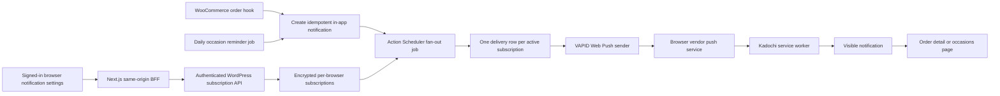

# Web Push Notifications Implementation Plan

## 1. Goal and scope

Add standards-based Web Push to Kadochi without Firebase SDKs or Firebase application services. Browsers subscribe through the Push API with a Kadochi VAPID public key; WordPress/WooCommerce stores one subscription per installed browser/device and sends encrypted messages directly to each browser vendor's standards-compliant push endpoint.

Initial push events:

- WooCommerce order placed, preparing, delivered, cancelled, and pending-payment events.
- Personal occasion reminders three days before the occasion.

Push is an additional delivery channel. The existing in-app notification center remains the source of truth and continues to work when push is unsupported, denied, delayed, or fails.

## 2. Current repository baseline

The implementation should extend the existing design rather than introduce a second event system:

- `plugins/kadochi-core/kadochi-core.php` already creates deduplicated rows in `wp_kadochi_notifications` using `(user_id, event_key)`.
- `woocommerce_payment_complete` and `woocommerce_order_status_changed` already generate the required order notification types.
- `kadochi_send_occasion_notifications` already runs daily and generates one `occasion_reminder` per occasion occurrence.
- The Next.js frontend uses same-origin `/api/**` routes as a BFF; its HttpOnly WordPress JWT must remain inaccessible to browser JavaScript.
- PWA icons exist in `front/public/pwa`, but the app currently has no web app manifest or service worker.

The notification row should become the durable event/outbox record. A push fan-out job starts only after that row exists. This preserves the current business rules and idempotency and prevents duplicate pushes when WooCommerce hooks or cron jobs repeat.

## 3. Target architecture



Responsibilities:

- **Browser/UI:** feature detection, install guidance, explicit permission request, service-worker registration, subscription creation, and subscription reconciliation.
- **Next.js BFF:** same-origin and CSRF boundary, input validation, JWT forwarding, and hiding WordPress topology from clients.
- **WordPress plugin:** subscription ownership and storage, event/outbox creation, payload construction, queueing, Web Push delivery, retries, cleanup, and operational health.
- **Push services:** transport only. Kadochi does not use Firebase SDKs, Firebase Admin, or FCM APIs; a Chromium subscription endpoint may still be hosted on a Google domain because that is the browser's standards-compliant push service.

## 4. Delivery and queue design

Do not send to external push endpoints inside checkout requests, WooCommerce status hooks, or the occasion scan. Network latency at a push service must not delay payment callbacks or order updates.

Use WooCommerce's bundled **Action Scheduler**:

1. Change `create_notification()` to return `{notification_id, inserted}` rather than a boolean.
2. For a newly inserted notification, enqueue a unique `kadochi_push_fanout` action with the notification ID.
3. The fan-out action snapshots all currently active subscriptions for the user and inserts one delivery row per `(notification_id, subscription_id)`.
4. Process deliveries in bounded batches (for example 100) with `minishlink/web-push`. Record every result before the action exits.
5. A minute-level reconciler finds notification rows whose fan-out was never completed and retryable delivery rows whose `available_at` has passed. This closes the crash window between database insertion and queue submission.
6. Existing notifications must be marked as already fanned out during migration. Deployment must never send historical notifications.

Run WordPress cron from a real production scheduler every minute (`wp cron event run --due-now` or an authenticated loopback runner); do not depend only on page traffic. Keep the occasion calculation in the configured WordPress timezone and schedule it at a documented local time, such as 09:00 Asia/Tehran.

### Retry classification

- `2xx`: mark the delivery `sent` and update subscription `last_success_at`.
- Library `isSubscriptionExpired()`, normally `404` or `410`: mark delivery `permanent_failure`; immediately mark the subscription `invalid` so it is excluded from all future fan-outs.
- `408`, `429`, and `5xx` or transport timeout: retry with capped exponential backoff and jitter, honoring `Retry-After` when present; suggested delays are 1, 5, 30, and 120 minutes, with at most five attempts.
- `400`: permanent payload/subscription error; deactivate the individual subscription when the report identifies it as invalid.
- `401`/`403`: normally a VAPID/configuration problem. Stop retrying that delivery after a small cap, surface a health alert, and do not mass-delete subscriptions.
- Any unknown permanent failure: retain a redacted reason and status for diagnosis, then mark `dead` after the retry cap.

Use short connect/request timeouts, disable redirects, set a bounded batch size, and never hold a database transaction open during an external request.

## 5. Database changes

Increment the plugin's database versions and install/migrate with `dbDelta`. Avoid MySQL foreign keys because WordPress tables and deployment tools commonly do not use them; maintain relationships in application code.

### Extend `wp_kadochi_notifications`

Add structured data so both the in-app UI and push sender no longer parse identifiers from translated message text:

| Column | Type | Purpose |
| --- | --- | --- |
| `title` | `varchar(191)` | Localized notification title |
| `target_path` | `varchar(500)` | Same-origin relative click destination |
| `context_json` | `text` | Minimal IDs such as `orderId` or `occasionId`; no customer/recipient data |
| `push_fanout_at` | `datetime null` | Null until the subscription snapshot is complete |

Backfill existing rows with `push_fanout_at = created_at`, derive structured fields only for in-app display where safe, and leave old rows out of push fan-out.

### New `wp_kadochi_push_subscriptions`

One row represents one browser profile/Home Screen installation, not one user preference shared across devices.

| Column | Type/index | Purpose |
| --- | --- | --- |
| `id` | `bigint unsigned`, PK | Server identifier |
| `user_id` | `bigint unsigned`, indexed with status | Current authenticated owner |
| `installation_id` | `char(36)` | Random client UUID; labeling/reconciliation only, never fingerprinting |
| `endpoint_hash` | `binary(32)`, unique | HMAC lookup/deduplication without exposing the capability URL |
| `subscription_ciphertext` | `longblob` | Encrypted JSON containing endpoint, `p256dh`, and `auth` |
| `subscription_nonce` | `binary(24)` | Sodium secretbox nonce |
| `key_version` | `smallint unsigned` | At-rest encryption key version |
| `vapid_key_id` | `varchar(50)` | VAPID pair that created this subscription |
| `content_encoding` | `varchar(20)` | Normally `aes128gcm` |
| `expiration_at` | `datetime null` | Browser-provided expiration when present |
| `status` | `varchar(20)` | `active`, `revoked`, or `invalid` |
| `failure_count` | `smallint unsigned` | Consecutive failure count |
| `last_seen_at` | `datetime` | Last successful browser reconciliation |
| `last_success_at` / `last_failure_at` | `datetime null` | Delivery health |
| `disabled_at`, `created_at`, `updated_at` | `datetime` | Lifecycle audit fields |

Use unique `(user_id, installation_id)` as a second guard. A global endpoint conflict may be reassigned only by a signed-in client that presents the complete current `PushSubscription`; this supports legitimate account changes on a shared browser. Do not collect raw user-agent strings, IP histories, or hardware fingerprints. A user-editable device label can be added later.

### New `wp_kadochi_push_deliveries`

| Column | Type/index | Purpose |
| --- | --- | --- |
| `id` | `bigint unsigned`, PK | Delivery identifier |
| `notification_id` | `bigint unsigned`, indexed | Canonical event |
| `subscription_id` | `bigint unsigned`, indexed | Target browser/device |
| `status` | `varchar(24)` | `pending`, `sending`, `retry`, `sent`, `permanent_failure`, or `dead` |
| `attempt_count` | `smallint unsigned` | Retry guard |
| `available_at` | `datetime`, queue index | Next eligible attempt |
| `response_status` | `smallint unsigned null` | Push service HTTP status |
| `failure_code` / `failure_reason` | bounded strings | Sanitized diagnostics, never endpoint or key material |
| `sent_at`, `created_at`, `updated_at` | `datetime null` | Audit and latency metrics |

Add a unique key on `(notification_id, subscription_id)`. Retain delivery metadata for a bounded period (for example 30 days), then prune it; retain only aggregate metrics longer term. Revoked/invalid subscriptions can be hard-deleted after a separate retention window once their delivery records have expired.

## 6. Backend implementation

### PHP dependency and sender

- Add a Composer package definition for `plugins/kadochi-core` with a pinned compatible `minishlink/web-push` major version and committed lockfile.
- Build the Composer vendor directory into the production plugin artifact; make the local Docker flow install it reproducibly rather than downloading dependencies at WordPress request time.
- Add small plugin classes/modules for `PushSubscriptionRepository`, `PushPayloadFactory`, `WebPushSender`, and queue handlers. The current single PHP file can register them, but encryption, HTTP delivery, and persistence should be independently testable.
- Configure VAPID and default options once per worker. Use JSON content type, `aes128gcm`, redirect blocking, and short timeouts.

### WordPress REST routes

Add protected routes under `kadochi/v1`; all ownership comes from `get_current_user_id()`, never a client-supplied user ID:

- `GET /push/config`: return only `{enabled, publicKey, keyId}`. It may be public, but return `Cache-Control: no-store` during key rotation.
- `GET /profile/push-subscription?installationId=...`: return current-device state and an opaque subscription record ID, never the stored endpoint or keys.
- `PUT /profile/push-subscription`: validate and upsert `{installationId, endpoint, expirationTime, keys: {p256dh, auth}, contentEncoding, vapidKeyId}`.
- `DELETE /profile/push-subscription`: revoke the authenticated user's row by installation ID; make repeated deletes return success.
- Optional non-production `POST /profile/push-subscription/test`: rate-limited and disabled in production unless an administrator explicitly enables it.

The corresponding Next routes belong under `front/src/app/api/push/config` and `front/src/app/api/profile/push-subscription`. Follow existing BFF patterns: Zod schemas, `assertSameOrigin`, `wordpressBearerHeaders`, `Cache-Control: no-store`, safe error normalization, and no mutation retries.

### Subscription validation

- Require authentication for reads/mutations other than the public VAPID key.
- Accept only strict JSON with bounded lengths: endpoint up to 2048 characters, base64url key fields with expected decoded sizes, UUID installation ID, recognized content encoding, and plausible expiration.
- Require an HTTPS endpoint with no embedded credentials or fragment.
- Prevent the endpoint from becoming an SSRF primitive. Maintain a configurable, reviewed allowlist for known browser push-service host suffixes; additionally reject loopback, private, link-local, and metadata-service addresses, disable redirects, and revalidate the destination at send time.
- Protect BFF mutations with the existing same-origin check and SameSite HttpOnly session cookie. The WordPress API remains protected by the forwarded bearer token.
- Rate-limit subscription churn and test sends per user/IP without logging endpoint values.

### Event integration

Update existing notification producers rather than adding parallel hooks:

- Order placed -> `/profile/orders/{orderId}`.
- Preparing/delivered/cancelled -> `/profile/orders/{orderId}`.
- Pending payment -> `/profile/orders/{orderId}` with a TTL no longer than the unpaid-order lifetime.
- Occasion reminder -> `/occasions` (or a future owned-occasion detail route).

Keep `(user_id, event_key)` as the business idempotency key. If both payment-complete and processing fire nearly together, product should explicitly decide whether both messages are valuable. Recommended initial policy: retain both in-app events but coalesce the system notification by using the same order notification `tag`, so the newest status replaces a stale status rather than stacking.

## 7. VAPID and encryption key management

Generate VAPID keys once in an offline/admin context using the PHP Web Push library. Never generate keys during container startup or application boot.

Required secrets/configuration:

- `KADOCHI_VAPID_ACTIVE_KEY_ID`
- `KADOCHI_VAPID_PUBLIC_KEY` (not secret; served to the browser)
- `KADOCHI_VAPID_PRIVATE_KEY` (WordPress worker only)
- `KADOCHI_VAPID_SUBJECT`, using a monitored `mailto:` address on the production domain
- `KADOCHI_PUSH_DATA_KEYS`, a versioned secret used to encrypt subscription material at rest
- `KADOCHI_PUSH_ENDPOINT_HMAC_KEY`, separate from the encryption and VAPID keys

Inject private values through the deployment secret manager. Do not put them in `NEXT_PUBLIC_*`, repository `.env` files, Docker images/layers, WordPress options, logs, health responses, or client bundles. The Next server may receive only the VAPID public key, or proxy it from WordPress.

At startup, validate that the active key ID, public/private pair, subject, and at-rest keys are present; disable sending and show a `manage_options` health error when configuration is incomplete.

VAPID rotation is staged because subscriptions are restricted to the public key used when they were created:

1. Add a new versioned pair while retaining the old private key.
2. Publish the new public key/key ID. On app reconciliation, compare `subscription.options.applicationServerKey`; unsubscribe and resubscribe when it differs.
3. Store `vapid_key_id` and select the matching private key when sending during migration.
4. Monitor the remaining old-key subscriptions, then revoke them and remove the old private key after the agreed migration window.

For an emergency private-key compromise, activate a new pair immediately, stop sends with the compromised key, mark old subscriptions for resubscription, and accept that users must revisit the app before push resumes.

## 8. Frontend and PWA changes

### Web app manifest

Add `front/src/app/manifest.ts` with at least:

- Stable `id: "/"`, `start_url: "/"`, Persian name/short name, `lang: "fa"`, and `dir: "rtl"`.
- `display: "standalone"`, theme/background colors, and shopping category.
- Existing 192px and 512px icons plus the 512px maskable icon.
- An `apple-touch-icon` in root metadata; add a purpose-built monochrome badge icon for notifications rather than using the full-color app icon as a badge.

Production must use HTTPS. Localhost is acceptable for local service-worker testing.

### Service worker

Add a deliberately small, dependency-free `front/public/sw.js`, registered at `/sw.js` with scope `/`. In the first release it should handle push only; do not add navigation/offline caching and risk stale checkout or authenticated pages.

Handlers:

- `install`/`activate`: use a controlled update policy and `clients.claim()`; do not unexpectedly force an incompatible worker over active checkout sessions.
- `push`: parse a versioned JSON payload defensively. Always call `registration.showNotification()` for a valid push because Web Push promises a user-visible result. If parsing fails, show a generic Kadochi notification rather than silently consuming it.
- `notificationclick`: close the notification, resolve only an allowlisted relative path against `self.location.origin`, find an existing same-origin window, navigate/focus it, or call `clients.openWindow()`.
- `notificationclose`: optional local analytics only; do not treat dismissal as a read receipt.
- `pushsubscriptionchange`: best-effort resubscription using the current public key and same-origin API. Because browser support is uneven, app-launch reconciliation remains mandatory.

Serve `sw.js` with `Content-Type: application/javascript`, `Service-Worker-Allowed: /`, and revalidation/no-cache headers so updates are detected. Never embed the private VAPID key or authentication token.

### Client push module and UI

Create a client-only push service/hook, for example under `front/src/features/push`, with a small state machine:

- `unsupported`
- `ios_install_required`
- `prompt_available`
- `subscribing`
- `enabled`
- `denied`
- `error`

Feature-detect `window.isSecureContext`, service workers, `PushManager`, and `Notification`; do not decide support from user-agent strings. iOS-specific install instructions may use standalone-display detection (`display-mode: standalone`, with `navigator.standalone` only as a compatibility fallback).

Add notification controls to the signed-in notification/profile area:

- Explain the concrete value before asking for permission.
- Offer a user-tapped **Enable notifications** button. Never prompt on page load, login, or during checkout.
- On iPhone/iPad when not installed, show **Add Kadochi to Home Screen**, then explain that the installed icon must be opened before enabling notifications.
- If permission is denied, show instructions for browser/OS notification settings; do not repeatedly call `requestPermission()`.
- When enabled, provide **Disable on this device**. Make clear that the setting affects only the current browser installation.

Subscribe only after a direct user gesture:

1. Ensure the authenticated session is current.
2. Register/wait for the service worker.
3. Call `Notification.requestPermission()`.
4. Convert the base64url public VAPID key to `Uint8Array` and call `pushManager.subscribe({userVisibleOnly: true, applicationServerKey})`.
5. `PUT` `subscription.toJSON()`, supported content encoding, VAPID key ID, and the locally generated installation UUID to the BFF.
6. If the backend save fails, call `subscription.unsubscribe()` as compensation and report a recoverable error.

### Reconciliation and account boundaries

On authenticated app startup, return to foreground, and successful login:

- Read `Notification.permission` and `registration.pushManager.getSubscription()`.
- If granted plus a subscription exists, compare the VAPID application server key and upsert it to refresh ownership/`last_seen_at`.
- If permission is granted but the subscription is missing, do not silently prompt; show an enable/repair action requiring a tap.
- If the browser subscription is missing/denied but a server record exists for the installation ID, revoke that server record.

On **Disable** and **Logout**, revoke the backend row while authentication is still valid and then call browser `unsubscribe()`. Use `finally` so the local subscription is invalidated even if the server call fails. Other tabs receiving the existing auth BroadcastChannel logout event should also unsubscribe locally. This prevents a shared browser from receiving the previous account's private notifications; server-side `404/410` cleanup handles any failed revocation.

Do not automatically unsubscribe other devices when one device logs out. Add a future “notification devices” management list if users need remote revocation.

## 9. Payload contract and click behavior

Use a compact, versioned UTF-8 JSON payload, comfortably below the Web Push compatibility limit:

```json
{
  "version": 1,
  "notificationId": 123,
  "type": "order_preparing",
  "title": "سفارش شما در حال آماده‌سازی است",
  "body": "آخرین وضعیت سفارش را در کادوچی ببینید.",
  "icon": "/pwa/icon-192.png",
  "badge": "/pwa/badge-96.png",
  "tag": "order-456",
  "data": {
    "url": "/profile/orders/456"
  }
}
```

Rules:

- Payload content comes from a server-side type map, never arbitrary client input.
- Include only the order number/status needed for navigation. Never include recipient name, address, phone, gift contents, payment data, JWTs, or signed URLs; lock-screen notifications are visible to people near the device.
- Default occasion push copy should be generic (“A personal occasion is three days away”) while the in-app notification retains the occasion title. If product wants the title on the lock screen, make that privacy tradeoff explicit to the user.
- `data.url` is always a relative allowlisted application path. The worker rejects cross-origin or malformed targets and falls back to `/profile/notifications`.
- Use an order-level `tag` to replace stale statuses. Use an occurrence-specific tag for occasions.
- Do not depend on notification action buttons; support differs, especially across Apple platforms. The whole notification must have useful click behavior.
- Suggested transport options: normal/high urgency and 24-hour TTL for order changes, TTL no longer than the one-hour draft lifetime for pending payment, and normal urgency with 24-hour TTL for occasion reminders. Use a short, URL-safe topic derived from the event/order ID where supported.
- A click does not automatically mark all in-app notifications read. Optionally add a narrowly scoped authenticated endpoint later to mark only `notificationId` read after the target page loads.

## 10. iOS and iPadOS Home Screen support

Standards-based Web Push is available for Home Screen web apps on iOS/iPadOS 16.4 and later. The site must be added to the Home Screen, opened from its icon, and request permission in response to a direct user action. No Apple Developer Program membership or APNs certificate is required. Ensure production egress permits Apple push hosts such as `*.push.apple.com`.

Required acceptance path on a real device:

1. Open Kadochi over HTTPS.
2. Use Share -> Add to Home Screen.
3. Launch the installed Kadochi icon and sign in.
4. Tap Enable notifications and accept the system prompt.
5. Background/close the PWA and trigger an order/occasion test event.
6. Verify Lock Screen/Notification Center display and that tapping opens the correct route inside the standalone app.
7. Verify Focus/notification settings, app badge behavior if implemented, disable, logout, reinstall, and multiple Home Screen installations.

Classic service-worker Web Push remains the baseline for cross-browser compatibility. Declarative Web Push can be evaluated later for newer Apple OS versions, but should not replace the classic payload/worker path until all target browsers and the chosen PHP library are verified.

## 11. Security and privacy checklist

- Explicit, revocable opt-in; no permission dark patterns or prompts without a user gesture.
- HTTPS, secure headers, same-origin BFF, authenticated WordPress mutations, and no client-supplied owner ID.
- Endpoint treated as a bearer capability: encrypted at rest, HMACed for lookup, redacted from logs/errors/admin screens, excluded from analytics, and never returned by status APIs.
- Dedicated versioned at-rest key, endpoint HMAC key, and VAPID private key with separate purposes.
- Strict request/payload schemas, size limits, rate limits, SSRF defenses, disabled redirects, and bounded timeouts.
- Minimal lock-screen content and no sensitive personal/order details.
- Per-device logout revocation, multi-tab cleanup, and automatic invalid-endpoint deactivation.
- Constant-time comparisons for hashes/secrets where applicable and least-privilege access to operational tooling.
- Define retention/deletion behavior for subscriptions and delivery logs, including account deletion/erasure.
- Add the push feature and external browser push processors to the privacy notice and consent copy.
- Review Content Security Policy and service-worker scope. The worker must not proxy/cache authenticated APIs or checkout in this phase.

## 12. Testing strategy

### Backend unit/integration tests

- Database migration and historical-row backfill do not enqueue old notifications.
- Duplicate `(user_id, event_key)` produces one notification and one delivery per active subscription.
- Subscription upsert, endpoint reassignment, revoke, ownership checks, strict field validation, encryption/decryption, and redacted logging.
- Payload snapshots for every order type and occasion reminder, including safe target paths and privacy exclusions.
- Fan-out to zero, one, and multiple subscriptions; a newly subscribed device does not receive historical events.
- Mock Web Push reports for success, `404/410`, `429` with `Retry-After`, `5xx`, timeout, and VAPID `401/403`.
- Retry cap, exponential backoff, concurrent-worker claim, and unique delivery idempotency.
- Occasion calculations across timezone boundaries, leap years, annual/nonannual records, and repeated cron execution.
- Account deletion and retention cleanup.

Use a mocked PSR HTTP client around `minishlink/web-push`; unit tests must never contact real vendor endpoints.

### Frontend tests

- Zod schemas and BFF route tests for config, status, put, delete, upstream errors, unauthenticated requests, and same-origin rejection.
- Push state-machine tests for unsupported, install-required, default, granted, denied, stale key, backend-save failure, disable, and logout.
- Service-worker tests for valid/malformed payloads, generic fallback, cross-origin URL rejection, focus/navigate/open behavior, and always-visible notification handling.
- Component/accessibility tests for Persian/RTL copy, keyboard activation, denied-state guidance, and per-device wording.

### Browser and end-to-end tests

- Chrome/Edge desktop and Android, Firefox desktop/Android, Safari macOS, and real iPhone/iPad Home Screen installs.
- Two browsers subscribed to one account both receive an event; disabling one leaves the other active.
- One browser switching accounts receives notifications only for the current account.
- Closed browser/PWA, background PWA, multiple open tabs, offline delivery within TTL, expired TTL, service-worker update, cleared site data, permission revoked in OS settings, and PWA uninstall/reinstall.
- Notification click while authenticated and signed out, including preservation of a safe post-login destination.
- Verify no duplicate system alerts when WooCommerce emits payment and status hooks close together.

For staging, use dedicated VAPID keys and test accounts. Add a protected test-send mechanism or WP-CLI command; never create fake production orders merely to test transport.

## 13. Observability and operations

Expose aggregate, access-controlled health data only:

- Active/revoked/invalid subscriptions.
- Fan-out pending count and age of oldest item.
- Delivery success, retry, permanent-failure, and latency rates by browser push-service host category (not full endpoint).
- `404/410`, `429`, `5xx`, and VAPID auth-error counts.
- Occasion scheduler last-run/last-success timestamps.
- Active VAPID key ID and count of subscriptions on retiring key IDs; never key material.

Use Action Scheduler's admin visibility plus structured application logs containing notification ID, subscription ID, endpoint HMAC prefix, attempt, and safe failure code. Alert on a growing queue, a missed daily reminder run, broad VAPID auth failures, or a sudden invalid-subscription spike.

Document runbooks for VAPID rotation/compromise, stuck queues, vendor outage/rate limiting, invalid-subscription cleanup, and disabling push globally without disabling in-app notifications.

## 14. Rollout sequence

1. **Foundation:** add reproducible PHP dependency packaging, keys/secrets, schema migrations, repositories, sender abstraction, and tests. Deploy with sending disabled.
2. **PWA/client:** add manifest, icons, service worker, BFF routes, client state machine, and profile setting. Verify subscription creation in staging.
3. **Delivery pipeline:** enable fan-out/delivery for protected test sends, validate retries/cleanup and operational dashboards.
4. **Order pilot:** enable order pushes for internal/test users, then a percentage/feature-flag cohort. Watch duplicate, invalid, and auth-error rates.
5. **Occasion pilot:** enable reminders after verifying production cron timing and generic privacy-safe copy.
6. **iOS release:** publish Add to Home Screen guidance only after real-device acceptance testing.
7. **General availability:** expand the flag, publish privacy/support documentation, and retain a server-side kill switch that stops new push fan-out while in-app notifications continue.

## 15. Definition of done

- A signed-in user can explicitly enable or disable push on each supported browser/PWA installation.
- Every active installation receives at most one push for each canonical event; other devices are unaffected by per-device disable/logout.
- Order and occasion events still create exactly one in-app notification if push delivery fails.
- No checkout/status request waits for a push-service network call.
- Notification clicks open only safe same-origin order/occasion routes and behave correctly from closed/background states.
- Invalid subscriptions stop receiving attempts after `404/410`; transient failures retry within policy and are observable.
- VAPID and subscription secrets are absent from browser bundles, logs, repository files, and WordPress options.
- Historical records are not pushed during migration.
- Real-device iOS/iPadOS Home Screen testing passes, including enable, receipt, click, disable, logout, and reinstall.
- Automated backend/frontend tests and the operational runbook are part of the release artifact.

## 16. Primary references

- [WebKit: Web Push for Web Apps on iOS and iPadOS](https://webkit.org/blog/13878/web-push-for-web-apps-on-ios-and-ipados/)
- [WebKit: Meet Web Push](https://webkit.org/blog/12945/meet-web-push/)
- [MDN: PushManager.subscribe()](https://developer.mozilla.org/en-US/docs/Web/API/PushManager/subscribe)
- [MDN: PushSubscription](https://developer.mozilla.org/en-US/docs/Web/API/PushSubscription)
- [MDN: notificationclick event](https://developer.mozilla.org/en-US/docs/Web/API/ServiceWorkerGlobalScope/notificationclick_event)
- [IETF RFC 8292: VAPID](https://datatracker.ietf.org/doc/html/rfc8292)
- [web-push-libs: PHP Web Push library](https://github.com/web-push-libs/web-push-php)

